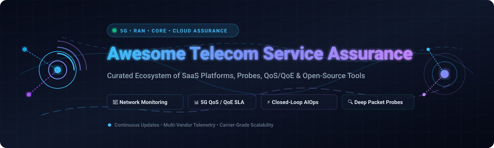
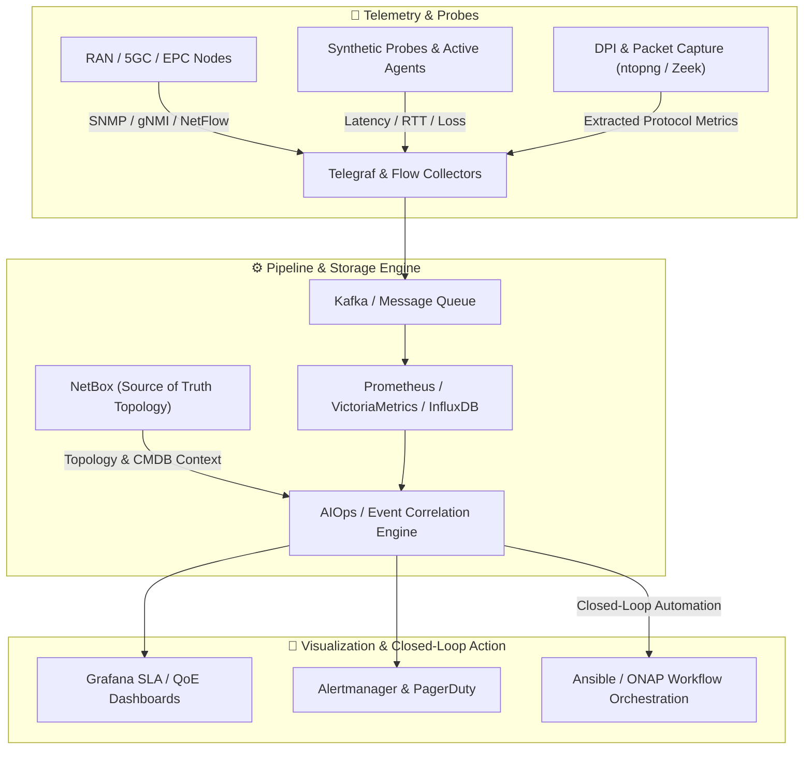

# 📡 Awesome-Telecom-Service-Assurance

  

  
  
  
  
  

---

## 🌐 Overview & Telecom Ecosystem

A curated list of **SaaS platforms**, **commercial suites**, and **open-source projects** for **Telecom Service Assurance (TSA)**, **Network Performance Monitoring & Diagnostics (NPMD)**, **5G/O-RAN Service Quality Assurance**, **Deep Packet Inspection (DPI) Telemetry**, **QoS/QoE Analytics**, and **Closed-Loop AIOps Automation**.

These carrier-grade tools empower Communication Service Providers (CSPs), Mobile Virtual Network Operators (MVNOs), Internet Service Providers (ISPs), and Private 5G enterprise operators to:
- 📊 **Monitor & Assure SLAs**: Real-time KPI/KQI tracking across RAN, Transport, 5G Core (5GC), IMS, and Multi-Cloud Edge.
- ⚡ **Automate Fault & Root-Cause Analysis (RCA)**: Multi-layer topology discovery, event correlation, alarm suppression, and automated remediation.
- 🎯 **Measure True Subscriber QoE**: Synthetic active testing, voice/video mean opinion score (MOS), user-plane throughput, and low-latency validation.
- 🛡️ **Assure Network Slicing & Security**: Real-time traffic flow anomaly detection, DDoS inspection, and BGP/peering performance assurance.

---

## 📑 Table of Contents

- [🏢 SaaS & Commercial Assurance Platforms](#-saas--commercial-assurance-platforms)
- [💻 Open-Source GitHub Projects](#-open-source-github-projects)
- [🧩 Architectural Blueprint & Frameworks](#-architectural-blueprint--frameworks)
- [📈 Star History](#-star-history)
- [🤝 How to Contribute](#-how-to-contribute)
- [⚖️ Disclaimer](#️-disclaimer)

---

## 🏢 SaaS & Commercial Assurance Platforms

*The table below is sorted descending by **Company Scale (Annual Revenue / Valuation)**.*

| Platform / Product | Focus & Core Capabilities | Company Scale (Revenue / Valuation) | Starting Pricing Tier | Free Tier / Free Trial Limits |
| :--- | :--- | :--- | :--- | :--- |
| **[Accedian (Cisco PCA)](https://www.accedian.com/)** | Active network performance monitoring, microsecond-level latency tracking, and synthetic experience testing across telco cloud and transport. | **~$56.7B Revenue** *(~$210B Market Cap, NASDAQ: CSCO)* | Starting at **~$1,500/month** (~$18,000/year) for Cisco Crosswork Assurance Essentials / Skylight sensor pack. | **30-day free trial / PoC** with up to 25 virtual test sensor endpoints and synthetic traffic generation. |
| **[Nokia Deepfield](https://www.nokia.com/)** | Real-time big data network analytics, IP network intelligence, DDoS mitigation (Defender), and carrier-scale traffic assurance (Genome). | **~€19.9B ($21.5B) Revenue** *(~$25B Market Cap, NYSE: NOK)* | Starting at **~$2,000/month** (~$24,000/year) base subscription scaling by monitored flow throughput (Gbps/Mpps). | **30-day guided Proof of Concept (PoC)** sandbox trial with live flow analysis and threat telemetry. |
| **[Amdocs Service Assurance](https://www.amdocs.com/)** | End-to-end service assurance, fault & performance correlation (Smart End-to-End Assurance), and automated root-cause orchestration for CSPs. | **~$4.53B Revenue** *(~$10.5B Market Cap, NASDAQ: DOX)* | Starting at **~$4,000/month** (~$48,000/year) base subscription for digital assurance & fault management modules. | **30-day PoC / sandbox environment** with pre-populated multi-layer topology and network fault data. |
| **[Viavi Solutions](https://www.viavisolutions.com/)** | End-to-end test, packet analysis, and automated assurance (Observer, TeraVM, NITRO) across fiber, 5G RAN, and transport networks. | **~$1.08B Revenue** *(~$2.2B Market Cap, NASDAQ: VIAV)* | Starting at **~$450/month per probe** (~$3,500 perpetual/instance entry license for Observer Apex). | **14 to 30-day evaluation trial** on request, providing full lab access to Observer Suite and TeraVM virtual test agents. |
| **[NETSCOUT](https://www.netscout.com/)** | Deep packet inspection (Smart Data), carrier-scale service visibility, and cyber/assurance telemetry (nGeniusONE, Omnis, vSTREAM). | **~$829M Revenue** *(~$1.7B Market Cap, NASDAQ: NTCT)* | Starting at **~$0.95/hour** (~$690/month PAYG on AWS) or **~$15,000/year** for base vSTREAM virtual appliance subscription. | **14-day free trial** for vSTREAM virtual probes on AWS Marketplace; **30-day guided PoC** for nGeniusONE virtual appliances. |
| **[EXFO](https://www.exfo.com/)** | Automated service assurance (Nova SensAI, Adaptive Service Assurance) and fiber/5G active test orchestration (EXFO Exchange). | **~$300M Revenue** *(~$400M Valuation, Private/Acquired)* | Starting at **~$1,200/month** (~$14,400/year) for EXFO Exchange and Nova Context starter licenses. | **30-day free trial / sandbox** for EXFO Exchange and Nova Active virtual agents with sample telemetry datasets. |
| **[Infovista](https://www.infovista.com/)** | Multi-domain 5G/RAN and core assurance (Ativa suite), RF network planning (Planet SaaS), and automated drive/bench testing (TEMS / VistaTest). | **~$180M Revenue** *(~$800M Valuation, PE: Apax/Seven2)* | Starting at **~$2,000/month** (~$24,000/year) for entry Ativa / Planet SaaS starter module. | **14-day guided cloud demo / sandbox** with pre-configured telco network slices and KPI analytics templates. |
| **[Roamware (Mobileum)](https://www.roamware.com/)** | Roaming service assurance, interconnect steering, fraud protection, and subscriber experience analytics (Active Intelligence platform). | **~$140M Revenue** *(~$700M Valuation, PE: Audax/HIG)* | Starting at **~$2,500/month** (~$30,000/year) for core roaming quality assurance & test monitoring module. | **30-day guided evaluation pilot** for roaming QoS verification and automated synthetic test call generation. |
| **[RADCOM](https://radcom.com/)** | Cloud-native automated assurance, 5G network intelligence, and containerized probe telemetry (RADCOM ACE) for virtualized carrier networks. | **~$71.5M Revenue** *(~$190M Market Cap, NASDAQ: RDCM)* | Starting at **~$3,000/month** (~$36,000/year) for entry cloud-native probe and network telemetry tier. | **30-day lab PoC / trial** deployment on AWS/Azure supporting up to 10 Gbps monitored interface capacity. |
| **[MYCOM OSI](https://www.mycom-osi.com/)** | Cloud-native Experience Assurance & Analytics (EAA) SaaS, multi-vendor performance and fault management for Tier-1 CSPs. | **~$55M Revenue** *(~$200M Valuation, PE: Inflexion)* | Starting at **~$3,500/month** (~$42,000/year) for entry EAA SaaS cloud deployment package. | **30-day enterprise trial / PoC** via AWS Marketplace for CSPs (monitoring up to 5,000 network entities). |

---

## 💻 Open-Source GitHub Projects

*The open-source projects below are sorted descending by **GitHub Star Counts**.*

- **[Grafana](https://github.com/grafana/grafana)**   
  Industry-standard open observability, interactive telemetry visualization, metric alerting, and unified dashboard engine widely deployed in telecom NOCs and SOCs.

- **[Prometheus](https://github.com/prometheus/prometheus)**   
  Cloud Native Computing Foundation (CNCF) time-series monitoring, service discovery, and multidimensional metric alerting stack powering 5G cloud-native network functions (CNFs).

- **[NetBox](https://github.com/netbox-community/netbox)**   
  Carrier-grade Network Infrastructure Source of Truth (DCIM & IPAM) providing programmatic device, circuit, VRF, and topology state for automated service assurance engines.

- **[Telegraf](https://github.com/influxdata/telegraf)**   
  Lightweight, plugin-driven telemetry collector supporting telecom protocols (SNMP, gNMI/gRPC network management, NetFlow, sFlow, Kafka, and IPFIX streaming telemetry).

- **[ntopng](https://github.com/ntop/ntopng)**   
  High-speed, web-based network traffic analysis and flow monitoring probe capable of deep packet inspection (nDPI), SLA latency tracking, and throughput profiling.

- **[Zeek](https://github.com/zeek/zeek)**   
  High-performance open network security monitoring and traffic analysis engine that transforms raw wire packets into structured, behavioral telemetry streams.

- **[Suricata](https://github.com/suricata/suricata)**   
  Multi-threaded Network IDS, IPS, and network security monitoring engine capable of real-time packet inspection and anomaly detection at multi-gigabit line rates.

- **[LibreNMS](https://github.com/librenms/librenms)**   
  Autodiscovering PHP/MySQL-based network monitoring system supporting comprehensive SNMP polling, BGP/OSPF peering state tracking, optical transceiver levels, and alert rules.

- **[Open5GS](https://github.com/open5gs/open5gs)**   
  C-language open-source 5G Core (5GC) and 4G EPC implementation with rich Prometheus metric instrumentation, Diameter/HTTP2 SBI tracing, and user plane diagnostics.

- **[free5GC](https://github.com/free5gc/free5gc)**   
  Open-source 3GPP Release 15/16-compliant 5G mobile core network in Golang, providing SBI transaction logs, protocol trace capture, and service-based architecture introspection.

- **[Icinga 2](https://github.com/Icinga/icinga2)**   
  Scalable, distributed monitoring engine verifying telecom infrastructure health, SLA threshold breaches, service availability, and automated remediation triggers.

- **[Cacti](https://github.com/Cacti/cacti)**   
  Robust, enterprise-proven RRDtool-based network graphing and time-series capacity monitoring solution used across ISPs and carrier transport networks.

- **[OpenNMS](https://github.com/OpenNMS/opennms)**   
  Enterprise-grade, carrier-scale open-source network management platform providing event correlation, active synthetic polling, flow analysis, and carrier fault/performance assurance.

- **[LibreQoS](https://github.com/LibreQoE/LibreQoS)**   
  ISP traffic management and Quality of Experience (QoE) platform leveraging eBPF/XDP and FQ-CoDel/CAKE scheduling to eliminate bufferbloat, shape subscriber plans, and graph RTT latency.

- **[Boda Telecom Suite CE (BTS-CE)](https://github.com/bodastage/bts-ce)**   
  Open-source, vendor-agnostic telecommunication RAN configuration management (CM) parser, network topology browser, parameter audit, and radio baseline compliance tool.

---

## 🧩 Architectural Blueprint & Frameworks

### 🛠️ Building a Custom Open-Source Assurance Stack

- **Metrics & Ingestion**: Deploy **Telegraf** and **Prometheus** for streaming gNMI/SNMP metrics and time-series telemetry.
- **Topology & Inventory**: Maintain your single source of truth in **NetBox** to feed topology context and device dependencies into correlation engines.
- **QoE & Access Optimization**: For ISP networks and fixed-wireless access (FWA), deploy **LibreQoS** for real-time bufferbloat mitigation and per-subscriber latency tracking.
- **DPI & Anomaly Detection**: Use **ntopng**, **Zeek**, or **Suricata** to inspect payload patterns and identify protocol degradation in high-throughput links.

---

## 📈 Star History

---

## 🤝 How to Contribute

1. 🍴 **Fork the repo** on GitHub.
2. 🌿 **Create a feature branch**: `git checkout -b feature/new-assurance-tool`.
3. 📝 **Add/edit entries in `README.md`**: Follow the established table or badge structure, maintaining alphabetical or sorted order where applicable.
4. 💡 **Ensure factual descriptions**: Include verifiable pricing models, free trial limits, or official GitHub links.
5. 🚀 **Submit a Pull Request (PR)** with a clear description of your contribution.

⭐ **Star the repo** if you find it helpful for your telecom network operations and engineering workflows!

---

## ⚖️ Disclaimer

- This repository is a **community-curated index** for informational and educational purposes.
- Telecom service assurance platforms handle mission-critical network telemetry and operational control. Always validate assurance pipelines and closed-loop scripts in non-production lab environments before impacting live subscriber services.
- Product names, logos, and brands are property of their respective owners.

---

  <b>Built with ❤️ for telecom engineers, network architects, SREs, and NOC teams worldwide.</b>

